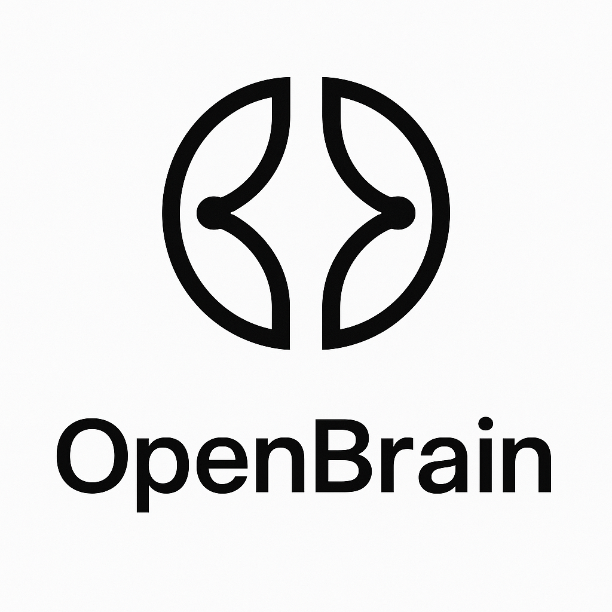

<p align="center">
  
</p>

<p align="center">
  <a href="https://github.com/llamasearchai/OpenBrain/actions/workflows/ci.yml">
    
  </a>
  
  
  
</p>

# OpenBrain

OpenBrain is a production-grade, local-first platform that renders an interactive human brain model in the browser, streams metrics from a FastAPI backend, and integrates agentic planning via LLM providers. The stack is tuned for local development and secure production deployment with observability.

## Highlights
- FastAPI backend with HTTP, WebSocket, metrics, and agent planning
- React + Vite + TypeScript frontend with 3D rendering (Three.js / R3F)
- Tests for backend (pytest) and frontend (Vitest + Testing Library)
- Docker Compose stack with optional LiteLLM proxy and observability
- Secure environment variable handling; no secrets in the repo

## Repository Layout
- `backend/app`: FastAPI API (`main.py`), agents (`agents.py`), config (`config.py`), CLI (`cli.py`)
- `backend/tests`: Pytest suite (HTTP, WS, GLTF, agent mocks)
- `web`: React + Vite + TypeScript app (`src/*`), Vitest tests
- `deploy`: Compose stack, LiteLLM, observability configs
- `scripts`: Developer convenience scripts
- `ops`: Backup/restore helpers
- `docs`: Production notes and architecture docs

## Requirements
- Python 3.11+
- Node 20+
- Docker (optional for full stack)

## Quick Start (Local, no Docker)
1) Backend setup
```
python3 -m venv backend/.venv
source backend/.venv/bin/activate
pip install -r backend/requirements.txt
```

2) Configure environment
```
cp .env.example .env
# Edit .env and set OPENAI_API_KEY if you plan to use OpenAI
# Optionally set OPENAI_BASE_URL to your LiteLLM proxy (defaults to http://127.0.0.1:4000)
```

3) Run API
```
(cd backend && uvicorn app.main:app --reload --host 127.0.0.1 --port 8000)
```

4) Frontend dev server
```
(cd web && npm ci && npm run dev)
```

Verify:
- API: `curl http://127.0.0.1:8000/healthz`
- Web: open http://127.0.0.1:5173

## Quick Start (Docker Compose)
```
./scripts/ob.sh
# or
docker compose -f deploy/compose.yml up -d
```

Verify:
- API: `curl http://127.0.0.1:8000/healthz`
- Web: http://127.0.0.1:5173
- Metrics: http://127.0.0.1:8000/metrics

## Assets
- Primary model: `web/public/models/openbrain/brain.gltf`
- Textures: `web/public/models/openbrain/textures/*`
- Approx size: ~21 MB (well under GitHub’s 100 MB per-file limit)
- Large-file handling: Git LFS is configured for model assets (see below). If you later add larger GLTF/GLB or textures, they will be tracked by LFS automatically.

## Git LFS
We configure Git LFS to version large binary assets in `web/public/models/*`.

Quick setup:
```
git lfs install
git add .gitattributes
git add web/public/models/openbrain
git commit -m "repo: track 3D assets with Git LFS"
```

## Author
- Nik Jois

## Environment Variables
Copy `.env.example` to `.env` and set values as needed.

- `OPENAI_API_KEY`: Required to call OpenAI directly (optional if using LiteLLM)
- `OPENAI_BASE_URL`: Base URL for OpenAI-compatible proxy (defaults to `http://127.0.0.1:4000`)
- `ANTHROPIC_API_KEY`: Optional for Anthropic
- `COHERE_API_KEY`: Optional for Cohere

The backend loads environment variables via Pydantic Settings (see `backend/app/config.py`). Secrets are never hard-coded.

## Development
- Backend
  - Run: `(cd backend && uvicorn app.main:app --reload --host 127.0.0.1 --port 8000)`
  - Tests: `pytest` (from repo root; `pytest.ini` configured)
  - Coverage target: `backend/app`

- Frontend
  - Install/build: `(cd web && npm ci && npm run build)`
  - Dev server: `(cd web && npm run dev)`
  - Test/lint: `(cd web && npm test)` and `(cd web && npm run lint)`

## Testing Strategy
- Python: Pytest with FastAPI `TestClient`; external LLM calls are avoided/mocked in tests (see `backend/tests/test_agents_success.py`). No external network in tests.
- Frontend: Vitest + jsdom + Testing Library; coverage configured in `web/vitest.config.ts`.

## Security & Secrets
- Do not commit secrets. `.env` is ignored by `.gitignore`.
- Use `.env` locally and CI secrets in your pipeline provider.
- If a secret was ever committed (e.g., `.env`), purge it from Git history:
  - Prefer `git filter-repo`:
    ```
    pipx install git-filter-repo  # or brew install
    git filter-repo --path .env --invert-paths
    git push --force --tags origin main
    ```
  - Or use BFG Repo-Cleaner.
- Consider Git LFS for very large assets (GLTF/FBX/textures) and/or host them via releases.

## Production Readiness
- CORS locked to localhost by default; configure allowed origins via env if needed
- Metrics at `/metrics`; optional OpenTelemetry via env
- Docker Compose for API, web, LiteLLM proxy, and observability
- Small, pure functions; PEP 8, type hints in Python; ESLint/TS rules for web

Checklist:
- [ ] `.env` not committed; secrets stored in CI or secret manager
- [ ] Backend unit/integration tests pass (`pytest`)
- [ ] Frontend tests and lint pass (`npm test`, `npm run lint`)
- [ ] Images/assets optimized; large assets managed via LFS or releases
- [ ] Basic SLOs/metrics validated; health checks respond OK

## Troubleshooting
- On missing Python packages: activate the venv and reinstall requirements.
- On frontend type issues: run `npm run lint` and `npm run build` to surface TS errors.
- On LLM calls during tests: ensure env keys are unset or use mocks; tests shouldn’t hit network.

## Contributing
Open an issue with context and repro steps. For PRs, use scope prefixes (e.g., `backend:`, `web:`) and include test evidence. CI must pass (`pytest`, `npm test`, `npm run lint`).
