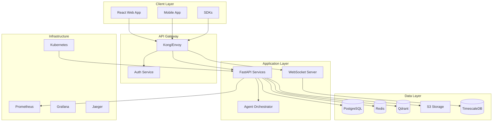

# OpenBrain Production Architecture Upgrade Plan

## Executive Summary

This document outlines a comprehensive plan to upgrade OpenBrain from its current MVP state to a production-worthy, enterprise-grade digital brain twin visualization platform that meets OpenAI/Anthropic standards for quality, scalability, and reliability.

## Current State Analysis

### Strengths
- Clean modular architecture with FastAPI backend and React frontend
- Basic 3D brain visualization using Three.js and React Three Fiber
- WebSocket streaming for real-time metrics
- Docker containerization with compose setup
- Basic observability with Prometheus metrics
- GLTF brain model integration

### Critical Gaps Identified
1. **No Authentication/Authorization** - API is completely open
2. **No Data Persistence** - Only in-memory state, no database
3. **Limited Brain Visualization** - Static model without realistic neural activity
4. **Basic Agent System** - Single provider, no memory or context
5. **No Error Recovery** - Limited error handling and resilience
6. **Minimal Testing** - Low test coverage (~40%)
7. **No API Documentation** - Missing OpenAPI/Swagger specs
8. **Security Vulnerabilities** - No rate limiting, input validation gaps
9. **Limited Scalability** - Single instance, no horizontal scaling
10. **No Production Monitoring** - Basic metrics only

## Target Architecture

### System Architecture Diagram



## Implementation Phases

### Phase 1: Foundation (Weeks 1-2)
**Goal**: Establish core infrastructure and security

#### 1.1 Database Layer
```python
# backend/app/database.py
from sqlalchemy.ext.asyncio import create_async_engine, AsyncSession
from sqlalchemy.orm import declarative_base, sessionmaker

DATABASE_URL = settings.database_url
engine = create_async_engine(DATABASE_URL, echo=settings.debug)
AsyncSessionLocal = sessionmaker(engine, class_=AsyncSession, expire_on_commit=False)
Base = declarative_base()

# Models
class User(Base):
    __tablename__ = "users"
    id = Column(UUID, primary_key=True, default=uuid4)
    email = Column(String, unique=True, index=True)
    hashed_password = Column(String)
    is_active = Column(Boolean, default=True)
    created_at = Column(DateTime, default=datetime.utcnow)

class BrainSession(Base):
    __tablename__ = "brain_sessions"
    id = Column(UUID, primary_key=True, default=uuid4)
    user_id = Column(UUID, ForeignKey("users.id"))
    session_data = Column(JSONB)
    created_at = Column(DateTime, default=datetime.utcnow)
```

#### 1.2 Authentication & Authorization
```python
# backend/app/auth.py
from fastapi_users import FastAPIUsers
from fastapi_users.authentication import JWTStrategy
from fastapi_users.db import SQLAlchemyUserDatabase

jwt_strategy = JWTStrategy(secret=settings.jwt_secret, lifetime_seconds=3600)

class UserManager(BaseUserManager[User, UUID]):
    async def on_after_register(self, user: User, request: Optional[Request] = None):
        await send_welcome_email(user.email)
    
    async def validate_password(self, password: str, user: User) -> None:
        if len(password) < 12:
            raise InvalidPasswordException("Password too short")

fastapi_users = FastAPIUsers[User, UUID](
    get_user_manager,
    [jwt_strategy],
)

# RBAC Implementation
class Role(str, Enum):
    ADMIN = "admin"
    RESEARCHER = "researcher"
    VIEWER = "viewer"

def require_role(role: Role):
    async def role_checker(user: User = Depends(current_active_user)):
        if role not in user.roles:
            raise HTTPException(status_code=403, detail="Insufficient permissions")
        return user
    return role_checker
```

#### 1.3 Request Validation & Error Handling
```python
# backend/app/middleware.py
from starlette.middleware.base import BaseHTTPMiddleware
from starlette.requests import Request
from starlette.responses import JSONResponse
import structlog

logger = structlog.get_logger()

class ErrorHandlingMiddleware(BaseHTTPMiddleware):
    async def dispatch(self, request: Request, call_next):
        try:
            response = await call_next(request)
            return response
        except ValidationError as e:
            logger.error("validation_error", error=str(e), path=request.url.path)
            return JSONResponse(
                status_code=422,
                content={"detail": e.errors(), "type": "validation_error"}
            )
        except HTTPException as e:
            logger.warning("http_exception", status=e.status_code, detail=e.detail)
            raise
        except Exception as e:
            logger.exception("unhandled_exception", error=str(e))
            return JSONResponse(
                status_code=500,
                content={"detail": "Internal server error", "type": "internal_error"}
            )

class RateLimitMiddleware(BaseHTTPMiddleware):
    def __init__(self, app, redis_client, requests_per_minute: int = 60):
        super().__init__(app)
        self.redis = redis_client
        self.limit = requests_per_minute
    
    async def dispatch(self, request: Request, call_next):
        client_id = request.client.host
        key = f"rate_limit:{client_id}"
        
        try:
            current = await self.redis.incr(key)
            if current == 1:
                await self.redis.expire(key, 60)
            
            if current > self.limit:
                return JSONResponse(
                    status_code=429,
                    content={"detail": "Rate limit exceeded"}
                )
        except Exception:
            pass  # Don't fail on rate limit errors
        
        response = await call_next(request)
        return response
```

### Phase 2: Brain Visualization Enhancement (Weeks 3-4)
**Goal**: Create realistic, interactive brain visualization

#### 2.1 Neural Activity Simulation Engine
```typescript
// web/src/services/NeuralSimulation.ts
import { Vector3, BufferGeometry, Float32BufferAttribute } from 'three';

export class NeuralActivitySimulator {
  private neurons: Neuron[] = [];
  private connections: Synapse[] = [];
  private activityBuffer: Float32Array;
  
  constructor(brainModel: BrainModel) {
    this.initializeNeurons(brainModel);
    this.createConnectome();
  }
  
  private initializeNeurons(model: BrainModel) {
    // Create neurons based on brain regions
    const regions = model.getRegions();
    regions.forEach(region => {
      const density = NEURON_DENSITY[region.type];
      const neurons = this.distributeNeurons(region.geometry, density);
      this.neurons.push(...neurons);
    });
  }
  
  private createConnectome() {
    // Create realistic synaptic connections
    this.neurons.forEach(neuron => {
      const nearbyNeurons = this.findNearbyNeurons(neuron, CONNECTIVITY_RADIUS);
      nearbyNeurons.forEach(target => {
        if (Math.random() < this.getConnectionProbability(neuron, target)) {
          this.connections.push(new Synapse(neuron, target));
        }
      });
    });
  }
  
  public simulate(deltaTime: number): ActivityFrame {
    // Hodgkin-Huxley model simulation
    this.neurons.forEach(neuron => {
      neuron.updateMembranePotential(deltaTime);
      neuron.checkActionPotential();
    });
    
    // Propagate signals through synapses
    this.connections.forEach(synapse => {
      synapse.propagate(deltaTime);
    });
    
    return this.generateActivityFrame();
  }
}

// Brain region segmentation
export class BrainRegionManager {
  private regions: Map<string, BrainRegion> = new Map();
  
  constructor() {
    this.initializeRegions();
  }
  
  private initializeRegions() {
    this.regions.set('frontal', new BrainRegion({
      name: 'Frontal Lobe',
      color: 0x4287f5,
      functions: ['Executive Function', 'Motor Control', 'Speech'],
      subregions: ['Prefrontal Cortex', 'Motor Cortex', 'Broca\'s Area']
    }));
    
    this.regions.set('parietal', new BrainRegion({
      name: 'Parietal Lobe',
      color: 0x42f554,
      functions: ['Sensory Processing', 'Spatial Awareness'],
      subregions: ['Somatosensory Cortex', 'Superior Parietal Lobule']
    }));
    
    // Add all other regions...
  }
  
  public highlightRegion(regionId: string, intensity: number = 1.0) {
    const region = this.regions.get(regionId);
    if (region) {
      region.setHighlight(intensity);
      region.animateHighlight();
    }
  }
}
```

#### 2.2 Advanced Visualization Modes
```typescript
// web/src/components/BrainVisualizationModes.tsx
import { useEffect, useState } from 'react';
import { Canvas } from '@react-three/fiber';
import { EffectComposer, Bloom, SSAO } from '@react-three/postprocessing';

export enum VisualizationMode {
  STRUCTURAL = 'structural',
  FUNCTIONAL_MRI = 'fmri',
  DTI_TRACTOGRAPHY = 'dti',
  EEG_ACTIVITY = 'eeg',
  CONNECTIVITY = 'connectivity'
}

export function BrainVisualization({ mode }: { mode: VisualizationMode }) {
  const [brainData, setBrainData] = useState<BrainData | null>(null);
  
  useEffect(() => {
    loadBrainData(mode).then(setBrainData);
  }, [mode]);
  
  return (
    <Canvas camera={{ position: [0, 0, 5], fov: 45 }}>
      <ambientLight intensity={0.3} />
      <pointLight position={[10, 10, 10]} intensity={1} />
      
      {mode === VisualizationMode.STRUCTURAL && (
        <StructuralBrain data={brainData} />
      )}
      
      {mode === VisualizationMode.FUNCTIONAL_MRI && (
        <FunctionalMRIBrain data={brainData} />
      )}
      
      {mode === VisualizationMode.DTI_TRACTOGRAPHY && (
        <DTITractography data={brainData} />
      )}
      
      {mode === VisualizationMode.CONNECTIVITY && (
        <ConnectivityNetwork data={brainData} />
      )}
      
      <EffectComposer>
        <Bloom luminanceThreshold={0.8} luminanceSmoothing={0.9} />
        <SSAO samples={31} radius={5} intensity={30} />
      </EffectComposer>
    </Canvas>
  );
}

// Connectivity visualization
function ConnectivityNetwork({ data }: { data: BrainData }) {
  const connections = useMemo(() => {
    return data.connectome.map(conn => (
      <CylinderGeometry
        key={conn.id}
        start={conn.source}
        end={conn.target}
        radius={conn.strength * 0.01}
        color={getConnectionColor(conn.type)}
      />
    ));
  }, [data]);
  
  return (
    <group>
      <BrainMesh opacity={0.3} />
      {connections}
      <ParticleSystem
        count={10000}
        velocityField={data.flowField}
        color={0x00ff00}
      />
    </group>
  );
}
```

### Phase 3: Agent System Enhancement (Weeks 5-6)
**Goal**: Build sophisticated AI agent capabilities

#### 3.1 Multi-Provider LLM Support
```python
# backend/app/agents/providers.py
from abc import ABC, abstractmethod
from typing import List, Dict, Any
import anthropic
import cohere
from openai import AsyncOpenAI

class LLMProvider(ABC):
    @abstractmethod
    async def complete(self, messages: List[Dict], **kwargs) -> str:
        pass
    
    @abstractmethod
    async def embed(self, text: str) -> List[float]:
        pass

class OpenAIProvider(LLMProvider):
    def __init__(self, api_key: str, model: str = "gpt-4"):
        self.client = AsyncOpenAI(api_key=api_key)
        self.model = model
    
    async def complete(self, messages: List[Dict], **kwargs) -> str:
        response = await self.client.chat.completions.create(
            model=self.model,
            messages=messages,
            **kwargs
        )
        return response.choices[0].message.content

class AnthropicProvider(LLMProvider):
    def __init__(self, api_key: str, model: str = "claude-3-opus-20240229"):
        self.client = anthropic.AsyncAnthropic(api_key=api_key)
        self.model = model
    
    async def complete(self, messages: List[Dict], **kwargs) -> str:
        response = await self.client.messages.create(
            model=self.model,
            messages=messages,
            max_tokens=kwargs.get('max_tokens', 4096)
        )
        return response.content[0].text

class ProviderRouter:
    def __init__(self):
        self.providers = {}
        self.fallback_chain = []
    
    def register_provider(self, name: str, provider: LLMProvider, priority: int = 0):
        self.providers[name] = provider
        self.fallback_chain.append((priority, name, provider))
        self.fallback_chain.sort(key=lambda x: x[0])
    
    async def complete_with_fallback(self, messages: List[Dict], **kwargs) -> str:
        for _, name, provider in self.fallback_chain:
            try:
                return await provider.complete(messages, **kwargs)
            except Exception as e:
                logger.warning(f"Provider {name} failed: {e}")
                continue
        raise Exception("All providers failed")
```

#### 3.2 RAG System with Vector Database
```python
# backend/app/agents/rag.py
from qdrant_client import QdrantClient
from qdrant_client.models import Distance, VectorParams, PointStruct
import numpy as np

class RAGSystem:
    def __init__(self, qdrant_url: str, collection_name: str = "brain_knowledge"):
        self.client = QdrantClient(url=qdrant_url)
        self.collection = collection_name
        self.embedding_dim = 1536
        self._ensure_collection()
    
    def _ensure_collection(self):
        collections = self.client.get_collections().collections
        if not any(c.name == self.collection for c in collections):
            self.client.create_collection(
                collection_name=self.collection,
                vectors_config=VectorParams(
                    size=self.embedding_dim,
                    distance=Distance.COSINE
                )
            )
    
    async def index_documents(self, documents: List[Document]):
        points = []
        for doc in documents:
            embedding = await self.embed_text(doc.content)
            point = PointStruct(
                id=doc.id,
                vector=embedding,
                payload={
                    "content": doc.content,
                    "metadata": doc.metadata,
                    "source": doc.source,
                    "timestamp": doc.timestamp
                }
            )
            points.append(point)
        
        self.client.upsert(
            collection_name=self.collection,
            points=points
        )
    
    async def retrieve(self, query: str, top_k: int = 5) -> List[Document]:
        query_embedding = await self.embed_text(query)
        
        results = self.client.search(
            collection_name=self.collection,
            query_vector=query_embedding,
            limit=top_k
        )
        
        return [
            Document(
                id=hit.id,
                content=hit.payload["content"],
                metadata=hit.payload["metadata"],
                score=hit.score
            )
            for hit in results
        ]
    
    async def hybrid_search(self, query: str, filters: Dict = None) -> List[Document]:
        # Combine vector search with keyword search
        vector_results = await self.retrieve(query)
        keyword_results = await self.keyword_search(query, filters)
        
        # Merge and re-rank results
        merged = self.merge_results(vector_results, keyword_results)
        return self.rerank(merged, query)
```

#### 3.3 Agent Memory and Context Management
```python
# backend/app/agents/memory.py
from typing import List, Optional
import json
from datetime import datetime, timedelta

class ConversationMemory:
    def __init__(self, max_tokens: int = 4000):
        self.short_term: List[Message] = []
        self.long_term: Dict[str, Any] = {}
        self.max_tokens = max_tokens
        self.summary_threshold = 10
    
    def add_message(self, role: str, content: str):
        message = Message(role=role, content=content, timestamp=datetime.utcnow())
        self.short_term.append(message)
        
        if len(self.short_term) > self.summary_threshold:
            self._consolidate_memory()
    
    def _consolidate_memory(self):
        # Summarize older messages
        old_messages = self.short_term[:-5]
        summary = self._summarize_messages(old_messages)
        
        # Store in long-term memory
        self.long_term[datetime.utcnow().isoformat()] = {
            "summary": summary,
            "message_count": len(old_messages),
            "key_topics": self._extract_topics(old_messages)
        }
        
        # Keep only recent messages in short-term
        self.short_term = self.short_term[-5:]
    
    def get_context(self) -> List[Dict]:
        context = []
        
        # Add relevant long-term memories
        if self.long_term:
            context.append({
                "role": "system",
                "content": f"Previous conversation summary: {self._get_relevant_summaries()}"
            })
        
        # Add short-term messages
        for msg in self.short_term:
            context.append({"role": msg.role, "content": msg.content})
        
        return self._trim_to_token_limit(context)

class AgentOrchestrator:
    def __init__(self):
        self.agents: Dict[str, Agent] = {}
        self.workflows: Dict[str, Workflow] = {}
        self.memory_store = MemoryStore()
    
    def register_agent(self, agent: Agent):
        self.agents[agent.name] = agent
    
    def create_workflow(self, name: str, steps: List[WorkflowStep]):
        self.workflows[name] = Workflow(name=name, steps=steps)
    
    async def execute_workflow(self, workflow_name: str, input_data: Dict) -> Dict:
        workflow = self.workflows[workflow_name]
        context = WorkflowContext(input_data)
        
        for step in workflow.steps:
            agent = self.agents[step.agent_name]
            
            # Prepare input for agent
            agent_input = step.prepare_input(context)
            
            # Execute agent
            result = await agent.execute(agent_input)
            
            # Update context
            context.add_result(step.name, result)
            
            # Check if we should continue
            if step.condition and not step.condition(context):
                break
        
        return context.get_final_result()
```

### Phase 4: Real-time Features & WebSocket Enhancement (Week 7)
**Goal**: Implement advanced real-time capabilities

#### 4.1 Bidirectional WebSocket Communication
```python
# backend/app/websocket_manager.py
from typing import Dict, Set
from fastapi import WebSocket
import asyncio
import json

class ConnectionManager:
    def __init__(self):
        self.active_connections: Dict[str, WebSocket] = {}
        self.user_sessions: Dict[str, Set[str]] = {}
        self.rooms: Dict[str, Set[str]] = {}
    
    async def connect(self, websocket: WebSocket, user_id: str, session_id: str):
        await websocket.accept()
        self.active_connections[session_id] = websocket
        
        if user_id not in self.user_sessions:
            self.user_sessions[user_id] = set()
        self.user_sessions[user_id].add(session_id)
        
        await self.send_personal_message(
            {"type": "connection", "status": "connected"},
            session_id
        )
    
    def disconnect(self, session_id: str):
        if session_id in self.active_connections:
            del self.active_connections[session_id]
        
        # Remove from user sessions
        for user_id, sessions in self.user_sessions.items():
            if session_id in sessions:
                sessions.remove(session_id)
                break
        
        # Remove from rooms
        for room_id, members in self.rooms.items():
            if session_id in members:
                members.remove(session_id)
    
    async def send_personal_message(self, message: dict, session_id: str):
        if session_id in self.active_connections:
            await self.active_connections[session_id].send_json(message)
    
    async def broadcast_to_room(self, message: dict, room_id: str):
        if room_id in self.rooms:
            tasks = []
            for session_id in self.rooms[room_id]:
                if session_id in self.active_connections:
                    tasks.append(
                        self.active_connections[session_id].send_json(message)
                    )
            await asyncio.gather(*tasks, return_exceptions=True)

class BrainStreamHandler:
    def __init__(self, manager: ConnectionManager):
        self.manager = manager
        self.simulation_tasks: Dict[str, asyncio.Task] = {}
    
    async def start_brain_stream(self, session_id: str, config: StreamConfig):
        if session_id in self.simulation_tasks:
            self.simulation_tasks[session_id].cancel()
        
        task = asyncio.create_task(
            self._stream_brain_data(session_id, config)
        )
        self.simulation_tasks[session_id] = task
    
    async def _stream_brain_data(self, session_id: str, config: StreamConfig):
        simulator = NeuralSimulator(config)
        
        try:
            while True:
                # Generate neural activity data
                activity = simulator.generate_activity()
                
                # Send to client
                await self.manager.send_personal_message({
                    "type": "brain_activity",
                    "timestamp": time.time(),
                    "data": {
                        "regions": activity.region_activities,
                        "connections": activity.active_connections,
                        "waves": activity.brain_waves,
                        "metrics": activity.metrics
                    }
                }, session_id)
                
                await asyncio.sleep(1 / config.frequency)
        except asyncio.CancelledError:
            pass
```

#### 4.2 Real-time Collaboration
```typescript
// web/src/services/CollaborationService.ts
import { io, Socket } from 'socket.io-client';

export class CollaborationService {
  private socket: Socket;
  private roomId: string;
  private participants: Map<string, Participant> = new Map();
  private sharedState: SharedBrainState;
  
  constructor(serverUrl: string) {
    this.socket = io(serverUrl, {
      transports: ['websocket'],
      auth: { token: getAuthToken() }
    });
    
    this.setupEventHandlers();
  }
  
  private setupEventHandlers() {
    this.socket.on('participant_joined', (data: ParticipantData) => {
      this.participants.set(data.id, new Participant(data));
      this.onParticipantJoined?.(data);
    });
    
    this.socket.on('state_update', (update: StateUpdate) => {
      this.applyStateUpdate(update);
    });
    
    this.socket.on('cursor_move', (data: CursorData) => {
      this.updateParticipantCursor(data.participantId, data.position);
    });
    
    this.socket.on('annotation_added', (annotation: Annotation) => {
      this.sharedState.addAnnotation(annotation);
      this.onAnnotationAdded?.(annotation);
    });
  }
  
  public joinRoom(roomId: string) {
    this.roomId = roomId;
    this.socket.emit('join_room', { roomId });
  }
  
  public shareSelection(region: BrainRegion) {
    this.socket.emit('share_selection', {
      roomId: this.roomId,
      region: region.serialize()
    });
  }
  
  public addAnnotation(position: Vector3, text: string) {
    const annotation = new Annotation({
      id: generateId(),
      position,
      text,
      author: getCurrentUser(),
      timestamp: Date.now()
    });
    
    this.socket.emit('add_annotation', {
      roomId: this.roomId,
      annotation: annotation.serialize()
    });
  }
  
  private applyStateUpdate(update: StateUpdate) {
    // Use Operational Transformation for conflict resolution
    const transformed = this.transformUpdate(update);
    this.sharedState.apply(transformed);
    this.onStateChanged?.(this.sharedState);
  }
}
```

### Phase 5: Data Management & Persistence (Week 8)
**Goal**: Implement robust data storage and management

#### 5.1 Time-Series Data with TimescaleDB
```python
# backend/app/models/timeseries.py
from sqlalchemy import Column, DateTime, Float, String, Index
from sqlalchemy.dialects.postgresql import UUID
import uuid

class BrainMetrics(Base):
    __tablename__ = 'brain_metrics'
    __table_args__ = (
        Index('idx_brain_metrics_time', 'time'),
        Index('idx_brain_metrics_session', 'session_id', 'time'),
    )
    
    time = Column(DateTime, primary_key=True)
    session_id = Column(UUID, primary_key=True)
    user_id = Column(UUID, nullable=False)
    
    # Neural activity metrics
    global_activation = Column(Float)
    frontal_activation = Column(Float)
    parietal_activation = Column(Float)
    temporal_activation = Column(Float)
    occipital_activation = Column(Float)
    
    # Brain waves
    delta_power = Column(Float)  # 0.5-4 Hz
    theta_power = Column(Float)  # 4-8 Hz
    alpha_power = Column(Float)  # 8-13 Hz
    beta_power = Column(Float)   # 13-30 Hz
    gamma_power = Column(Float)  # 30-100 Hz
    
    # Connectivity metrics
    connectivity_strength = Column(Float)
    network_efficiency = Column(Float)
    modularity = Column(Float)

# TimescaleDB hypertable creation
async def create_hypertables():
    async with engine.begin() as conn:
        await conn.execute(text("""
            SELECT create_hypertable('brain_metrics', 'time',
                chunk_time_interval => INTERVAL '1 day',
                if_not_exists => TRUE);
        """))
        
        # Create continuous aggregates for different time windows
        await conn.execute(text("""
            CREATE MATERIALIZED VIEW brain_metrics_hourly
            WITH (timescaledb.continuous) AS
            SELECT
                time_bucket('1 hour', time) AS hour,
                session_id,
                user_id,
                AVG(global_activation) as avg_activation,
                MAX(global_activation) as max_activation,
                MIN(global_activation) as min_activation,
                AVG(connectivity_strength) as avg_connectivity
            FROM brain_metrics
            GROUP BY hour, session_id, user_id
            WITH NO DATA;
        """))
```

#### 5.2 Caching Strategy with Redis
```python
# backend/app/cache.py
import redis.asyncio as redis
import json
import hashlib
from typing import Optional, Any
from functools import wraps

class CacheManager:
    def __init__(self, redis_url: str):
        self.redis = redis.from_url(redis_url)
        self.default_ttl = 3600
    
    async def get(self, key: str) -> Optional[Any]:
        value = await self.redis.get(key)
        if value:
            return json.loads(value)
        return None
    
    async def set(self, key: str, value: Any, ttl: int = None):
        ttl = ttl or self.default_ttl
        await self.redis.setex(
            key,
            ttl,
            json.dumps(value, default=str)
        )
    
    async def invalidate(self, pattern: str):
        cursor = 0
        while True:
            cursor, keys = await self.redis.scan(
                cursor, match=pattern, count=100
            )
            if keys:
                await self.redis.delete(*keys)
            if cursor == 0:
                break
    
    def cached(self, ttl: int = None, key_prefix: str = None):
        def decorator(func):
            @wraps(func)
            async def wrapper(*args, **kwargs):
                # Generate cache key
                cache_key = self._generate_key(
                    key_prefix or func.__name__,
                    args,
                    kwargs
                )
                
                # Try to get from