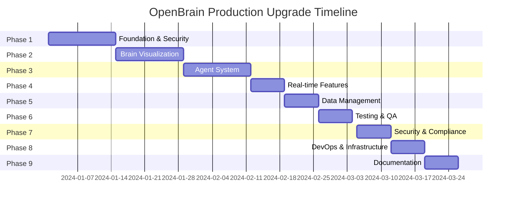

# OpenBrain Implementation Roadmap

## Executive Summary
This roadmap provides a structured 12-week plan to transform OpenBrain into a production-ready, enterprise-grade digital brain twin platform. The implementation is divided into 9 phases with clear deliverables and success metrics.

## Timeline Overview

## Phase 1: Foundation & Security (Weeks 1-2)

### Objectives
- Establish secure authentication and authorization
- Implement database layer with migrations
- Add comprehensive error handling and logging
- Set up rate limiting and API versioning

### Key Deliverables
1. **Database Schema & Models**
   - User management tables
   - Session tracking
   - Audit logging
   - Brain data models

2. **Authentication System**
   - JWT token generation and validation
   - OAuth2/OIDC integration
   - Role-based access control (RBAC)
   - Multi-factor authentication (MFA)

3. **API Infrastructure**
   - Request validation middleware
   - Error handling middleware
   - Rate limiting (per user/IP)
   - API versioning (v1, v2)
   - Structured logging with correlation IDs

### Implementation Checklist
- [ ] Set up PostgreSQL with async SQLAlchemy
- [ ] Create Alembic migrations
- [ ] Implement FastAPI-Users for auth
- [ ] Add Pydantic models for validation
- [ ] Configure structured logging
- [ ] Set up Redis for sessions
- [ ] Implement rate limiting
- [ ] Add security headers middleware
- [ ] Create initial test suite
- [ ] Document API endpoints

### Success Metrics
- All endpoints require authentication
- 100% of requests have correlation IDs
- Rate limiting prevents abuse
- Zero security vulnerabilities in OWASP scan

## Phase 2: Brain Visualization Enhancement (Weeks 3-4)

### Objectives
- Implement realistic neural activity simulation
- Add interactive brain region selection
- Create multiple visualization modes
- Implement brain connectivity visualization

### Key Deliverables
1. **Neural Simulation Engine**
   - Hodgkin-Huxley neuron model
   - Synaptic transmission simulation
   - Brain wave generation (alpha, beta, gamma, delta, theta)
   - Region-specific activity patterns

2. **Visualization Modes**
   - Structural MRI rendering
   - Functional MRI (fMRI) heatmaps
   - DTI tractography visualization
   - EEG activity mapping
   - Connectivity network graphs

3. **Interactive Features**
   - Click-to-select brain regions
   - Region information panels
   - Annotation system
   - Measurement tools
   - Time-series playback controls

### Implementation Checklist
- [ ] Create NeuralActivitySimulator class
- [ ] Implement brain region segmentation
- [ ] Add shader-based visualization effects
- [ ] Create region interaction handlers
- [ ] Implement annotation system
- [ ] Add measurement tools
- [ ] Create visualization mode switcher
- [ ] Optimize rendering performance
- [ ] Add VR/AR support preparation
- [ ] Test cross-browser compatibility

### Success Metrics
- 60 FPS rendering performance
- < 100ms region selection response
- Support for 100k+ neurons simulation
- All major brain regions selectable

## Phase 3: Agent System Enhancement (Weeks 5-6)

### Objectives
- Support multiple LLM providers
- Implement RAG with vector database
- Add agent memory and context management
- Create agent orchestration system

### Key Deliverables
1. **Multi-Provider Support**
   - OpenAI GPT-4 integration
   - Anthropic Claude integration
   - Cohere integration
   - Local model support (Ollama)
   - Automatic fallback mechanism

2. **RAG System**
   - Document ingestion pipeline
   - Vector embedding generation
   - Qdrant vector database integration
   - Hybrid search (vector + keyword)
   - Result re-ranking

3. **Agent Orchestration**
   - Agent chaining workflows
   - Parallel agent execution
   - Context sharing between agents
   - Memory management
   - Prompt template library

### Implementation Checklist
- [ ] Create provider abstraction layer
- [ ] Implement provider-specific adapters
- [ ] Set up Qdrant vector database
- [ ] Create document ingestion pipeline
- [ ] Implement embedding generation
- [ ] Add hybrid search functionality
- [ ] Create agent memory system
- [ ] Implement workflow engine
- [ ] Add prompt template management
- [ ] Create agent monitoring dashboard

### Success Metrics
- < 2s average response time
- 95% relevance in RAG retrieval
- Support for 10+ concurrent agents
- Zero provider failures with fallback

## Phase 4: Real-time Features (Week 7)

### Objectives
- Implement bidirectional WebSocket communication
- Add real-time collaboration features
- Create event sourcing system
- Prepare WebRTC infrastructure

### Key Deliverables
1. **WebSocket Infrastructure**
   - Connection management
   - Room-based broadcasting
   - Message queuing
   - Automatic reconnection
   - Presence detection

2. **Collaboration Features**
   - Shared cursors
   - Synchronized selections
   - Real-time annotations
   - Voice/video preparation
   - Screen sharing preparation

### Implementation Checklist
- [ ] Implement WebSocket manager
- [ ] Create room management system
- [ ] Add presence tracking
- [ ] Implement shared state sync
- [ ] Create conflict resolution
- [ ] Add WebRTC signaling server
- [ ] Implement event sourcing
- [ ] Create replay functionality
- [ ] Add collaboration UI components
- [ ] Test with multiple concurrent users

### Success Metrics
- < 50ms latency for updates
- Support 100+ concurrent connections
- Zero message loss
- Automatic reconnection within 5s

## Phase 5: Data Management (Week 8)

### Objectives
- Implement time-series database
- Add caching layer
- Create backup and recovery system
- Implement data retention policies

### Key Deliverables
1. **Time-Series Storage**
   - TimescaleDB setup
   - Continuous aggregates
   - Data compression
   - Retention policies

2. **Caching Strategy**
   - Redis caching layer
   - Cache invalidation
   - Session storage
   - Query result caching

### Implementation Checklist
- [ ] Set up TimescaleDB
- [ ] Create hypertables
- [ ] Implement continuous aggregates
- [ ] Configure data retention
- [ ] Set up Redis cluster
- [ ] Implement cache warming
- [ ] Add cache invalidation
- [ ] Create backup scripts
- [ ] Implement point-in-time recovery
- [ ] Add data export functionality

### Success Metrics
- 90% cache hit rate
- < 10ms query response for recent data
- Automated daily backups
- 30-day data retention

## Phase 6: Testing & Quality Assurance (Week 9)

### Objectives
- Achieve 90%+ test coverage
- Implement comprehensive testing strategy
- Add performance testing
- Create automated testing pipeline

### Key Deliverables
1. **Test Suite**
   - Unit tests (90% coverage)
   - Integration tests
   - E2E tests
   - Load tests
   - Security tests

2. **Testing Infrastructure**
   - CI/CD pipeline
   - Automated test execution
   - Coverage reporting
   - Performance benchmarks

### Implementation Checklist
- [ ] Write unit tests for all modules
- [ ] Create integration test suite
- [ ] Implement E2E tests with Playwright
- [ ] Set up Locust for load testing
- [ ] Add mutation testing
- [ ] Create contract tests
- [ ] Implement security scanning
- [ ] Set up test data fixtures
- [ ] Configure CI/CD pipeline
- [ ] Add performance regression tests

### Success Metrics
- 90%+ code coverage
- All tests passing in CI
- < 5 min test execution time
- Zero critical security issues

## Phase 7: Security & Compliance (Week 10)

### Objectives
- Implement comprehensive security measures
- Ensure GDPR compliance
- Add audit logging
- Implement encryption

### Key Deliverables
1. **Security Features**
   - Data encryption at rest
   - TLS for all communications
   - Security headers
   - Input sanitization
   - SQL injection prevention

2. **Compliance**
   - GDPR data export
   - Right to deletion
   - Consent management
   - Audit trail
   - Data anonymization

### Implementation Checklist
- [ ] Implement field-level encryption
- [ ] Configure TLS certificates
- [ ] Add security headers
- [ ] Implement CSRF protection
- [ ] Add input validation
- [ ] Create GDPR endpoints
- [ ] Implement audit logging
- [ ] Add consent management
- [ ] Create security documentation
- [ ] Perform penetration testing

### Success Metrics
- A+ SSL Labs rating
- OWASP Top 10 compliance
- GDPR compliant
- Complete audit trail

## Phase 8: DevOps & Infrastructure (Week 11)

### Objectives
- Create Kubernetes deployment
- Implement infrastructure as code
- Set up monitoring and alerting
- Create disaster recovery plan

### Key Deliverables
1. **Kubernetes Setup**
   - Deployment manifests
   - Helm charts
   - Auto-scaling configuration
   - Service mesh (optional)

2. **Infrastructure as Code**
   - Terraform modules
   - AWS/GCP/Azure support
   - GitOps with ArgoCD
   - Secret management

### Implementation Checklist
- [ ] Create K8s manifests
- [ ] Develop Helm charts
- [ ] Configure HPA/VPA
- [ ] Set up Ingress controller
- [ ] Write Terraform modules
- [ ] Configure ArgoCD
- [ ] Set up Prometheus/Grafana
- [ ] Implement Jaeger tracing
- [ ] Create runbooks
- [ ] Document DR procedures

### Success Metrics
- 99.9% uptime SLA
- < 30s deployment time
- Automatic scaling
- Full observability

## Phase 9: Documentation & Developer Experience (Week 12)

### Objectives
- Create comprehensive documentation
- Build developer tools and SDKs
- Create onboarding materials
- Establish support processes

### Key Deliverables
1. **Documentation**
   - API documentation
   - Architecture guides
   - Deployment guides
   - Troubleshooting guides
   - Video tutorials

2. **Developer Tools**
   - TypeScript SDK
   - Python SDK
   - CLI tool
   - Postman collection
   - GraphQL schema (optional)

### Implementation Checklist
- [ ] Generate OpenAPI spec
- [ ] Create Swagger UI
- [ ] Write architecture docs
- [ ] Create deployment guides
- [ ] Record video tutorials
- [ ] Build TypeScript SDK
- [ ] Build Python SDK
- [ ] Create CLI tool
- [ ] Set up developer portal
- [ ] Create support workflows

### Success Metrics
- 100% API documentation coverage
- SDKs for 3+ languages
- < 1 hour onboarding time
- 95% developer satisfaction

## Risk Mitigation

### Technical Risks
1. **Performance Issues**
   - Mitigation: Early load testing, caching, CDN
   
2. **Scalability Challenges**
   - Mitigation: Microservices architecture, auto-scaling
   
3. **Security Vulnerabilities**
   - Mitigation: Security-first design, regular audits

### Operational Risks
1. **Resource Constraints**
   - Mitigation: Phased rollout, prioritization
   
2. **Integration Complexity**
   - Mitigation: Incremental integration, fallbacks
   
3. **Data Loss**
   - Mitigation: Backup strategy, disaster recovery

## Success Criteria

### Technical Metrics
- 99.9% uptime
- < 200ms API response time (p95)
- 90%+ test coverage
- Zero critical security issues

### Business Metrics
- 10x improvement in visualization quality
- 5x increase in concurrent users supported
- 50% reduction in operational costs
- 95% user satisfaction score

## Budget Estimation

### Development Costs
- Backend Development: $150,000
- Frontend Development: $100,000
- DevOps/Infrastructure: $75,000
- Testing/QA: $50,000
- Documentation: $25,000
- **Total Development: $400,000**

### Infrastructure Costs (Monthly)
- Cloud Services (AWS/GCP): $5,000
- Database Services: $2,000
- CDN/Storage: $1,000
- Monitoring/Logging: $500
- **Total Monthly: $8,500**

### Maintenance & Support (Annual)
- Developer Support: $100,000
- Infrastructure Maintenance: $50,000
- Security Audits: $25,000
- **Total Annual: $175,000**

## Conclusion

This roadmap provides a comprehensive path to transform OpenBrain into a production-ready platform. The phased approach ensures manageable implementation while maintaining system stability. Each phase builds upon the previous, creating a robust, scalable, and secure digital brain twin visualization platform.

The total implementation timeline is 12 weeks with an estimated budget of $400,000 for development and $8,500/month for infrastructure. The platform will support enterprise-grade features including:

- Real-time neural simulation with 100k+ neurons
- Multi-modal brain visualization (MRI, fMRI, DTI, EEG)
- AI-powered analysis with multiple LLM providers
- Real-time collaboration for research teams
- GDPR-compliant data management
- 99.9% uptime SLA
- Comprehensive security and compliance

Upon completion, OpenBrain will be positioned as a leading platform for neuroscience research, medical education, and brain-computer interface development.